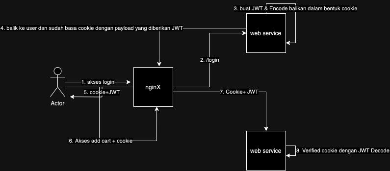

# PHP Session Management dengan JWT

## FLOW
1. user akses halaman login
2. user login kirim data (username - password)
3. web server -> buat jwt -> masukin ke cookie
4. web server balikin ke nginX dengan bawa JWT (payload)
5. user akses halaman add to cart + bawa jwt
6. web server verified jwt dengan decode dengan secret key yang sudah di buat diserver

### problem 
-   JWT dicuri
    
    set httpOnly menjadi true

-   jika payload yang dimasukan hanya berupa usernama + password maka nilai string randomnya akan sama terus menerus

    solusinya buat session_id berupa random string masukan ke dalam payload dan database, ketika user masuk buatkan ketika logout hapus didatabase